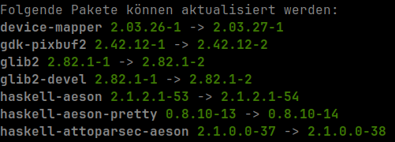

# s7-updates-motd

This small Arch Linux package add the updateable packages to the message of the day `/etc/motd.d`. A Systemd timer will update that every 4 hours.



You need to enable `Login-Shell` in your terminal emulator of choise in order to work.

Add the following script lines to your `.bashrc` file or create a `/etc/profiles.d/showmotd.sh` file:

```shell
#!/bin/bash

if [ -z "$(env | grep XDG_SESSION_TYPE=tty)" ]; then
        [ -f /etc/motd ] && cat /etc/motd
        find /etc/motd.d -type f -exec cat {} \;
fi
```
